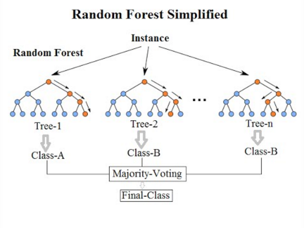
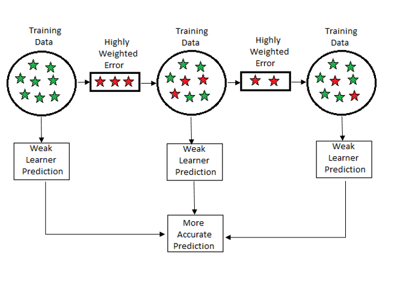
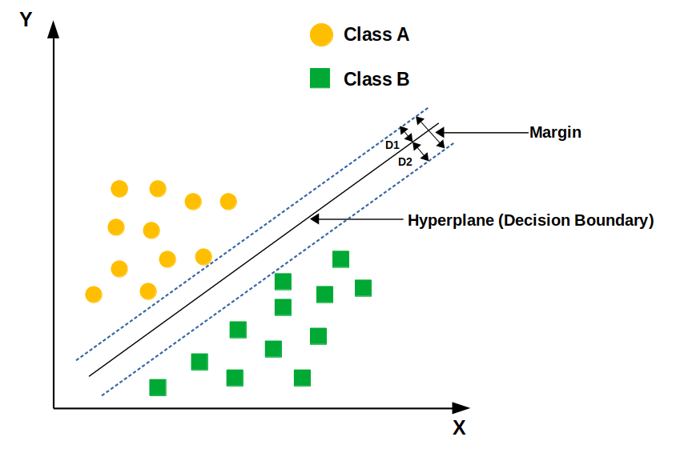
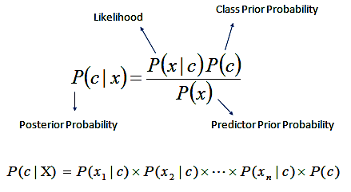

# cardiovascular-disease-prediction

### 1. Introduction

This project implements a machine learning pipeline to predict the risk of cardiovascular disease (CVD) based on patient data. The model analyzes clinical and demographic features to classify individuals as at-risk or not, helping with early detection and preventive care.

### 2. Dashboard 

### 3. EDA (Exploratory Data Analysis)

This dataset has 12 features and 1 outcome, with 299 patients.

|Variable Name	|Role|	Type|	Demographic|	Description|	Units|	Missing Values
|---|---|---|---|---|---|---|
age	|Feature	|Integer|	Age	|age of the patient	|years	|no
anaemia	|Feature|	Binary	|	|decrease of red blood cells or hemoglobin|	|	no
creatinine_phosphokinase	|Feature|	Integer	| |	level of the CPK enzyme in the blood	|mcg/L	|no
diabetes|	Feature|	Binary	| |	if the patient has diabetes|	|	no
ejection_fraction	|Feature	|Integer|	|	percentage of blood leaving the heart at each contraction	|%	|no
high_blood_pressure|	Feature	|Binary|	|	if the patient has hypertension|	|	no
platelets	|Feature	|Continuous|	|	platelets in the blood	|kiloplatelets/mL	|no
serum_creatinine	|Feature	|Continuous|	|	level of serum creatinine in the blood|	mg/dL|	no
serum_sodium|	Feature	|Integer|	|	level of serum sodium in the blood	|mEq/L|	no
sex	|Feature	|Binary	|Sex	|woman or man	| |	no

First we need to check if all of our values are in appropriate intervals. We can do this by checking the information about the dataset.

| |	age	|anaemia|	creatinine_phosphokinase|	diabetes|	ejection_fraction|	high_blood_pressure|	platelets|	serum_creatinine|	serum_sodium|	sex|	smoking|	time|	DEATH_EVENT|
|---|---|---|---|---|---|---|---|---|---|---|---|---|---|
count	|299.0|	299.0|	299.0|	299.0|	299.0|	299.0|	299.0|	299.0|	299.0|	299.0|	299.0|	299.0|	299.0
mean	|60.83389297658862|	0.431438127090301	|581.8394648829432	|0.4180602006688963|	38.08361204013378	|0.3511705685618729	|263358.02926421404	|1.3938795986622072	|136.62541806020067	|0.6488294314381271|	0.3210702341137124|	130.2608695652174	|0.3210702341137124
std	|11.89480907404447|	0.4961072681330793	|970.2878807124362	|0.49406706510360904|	11.834840741039171|	0.47813637906274475	|97804.2368685983	|1.0345100640898541	|4.412477283909235	|0.47813637906274475|	0.46767042805677167	|77.61420795029339|	0.46767042805677167
min	|40.0|	0.0|	23.0|	0.0|	14.0|	0.0|	25100.0|	0.5|	113.0	|0.0|	0.0|	4.0|	0.0
25%|	51.0	|0.0|	116.5	|0.0	|30.0	|0.0|	212500.0	|0.9|	134.0	|0.0	|0.0|	73.0	|0.0
50%	|60.0|	0.0|	250.0	|0.0|	38.0	|0.0|	262000.0|	1.1|	137.0|	1.0|	0.0|	115.0|	0.0
75%|	70.0	|1.0|	582.0	|1.0|	45.0	|1.0|	303500.0	|1.4	|140.0	|1.0	|1.0|	203.0	|1.0
max	|95.0|	1.0|	7861.0	|1.0|	80.0	|1.0|	850000.0	|9.4|	148.0	|1.0|	1.0|	285.0|	1.0

Next, we should check if the classes are balanced or not.

We can see that the classes are not balanced, which happens often in real life datasets, and we should keep this in mind.

We can also take a look at means and standard deviations of distributions of continious features.

It is useful to also look at correlation between features themselves, and also with the outcome.

Based on the correlation heatmap matrix, we can notice which features have the most correlation with the outcome.
Feature |Correlation with outcome
|---|---|
time| -0.54 
serum_creatinine| 0.37 
ejection_fraction| -0.29 
age |0.22 
serum_sodium| -0.21 
high_blood_pressure| 0.079 
anaemia| 0.066 
platelets |-0.046 
creatinine_phosphokinase| 0.024 
smoking |-0.013 
sex| -0.0043 
diabetes|-0.0019 

It is interesting to see which features are correlated whith each other.

Features | Correlation
|---|---|
sex & smoking |0.45 
serum_creatinine & serum_sodium|-0.3 

We can also calculate Information Gain (IG) for each feature.

Feature |IG coefficient 
---|---
time| 0.235042 
serum_creatinine |0.097463 
ejection_fraction| 0.072724 
serum_sodium| 0.069616 
age |0.050366 
creatinine_phosphokinase| 0.041297 
sex |0.002352 
anaemia |0.000000 
diabetes| 0.000000 
high_blood_pressure| 0.000000 
platelets| 0.000000 
smoking| 0.000000 

### 4. Simple models

Let us first start with the most simple models. One of the most simple models is just counting appearances of each class, and using that class as an outcome for every new patient. This would give us:

F1-score | Accuracy | TP rate | TN rate
---|---|---|---
0.0000|0.6789|0.0000|1.0000

which is a pretty bad result, but it gives as a benchmark for other models.

Next, we can try a simple tree.

Metrics of this kind of classifier are:

F1-score | Accuracy | TP rate | TN rate
---|---|---|---
0.5238|0.6567|0.4783|0.7038

which are much better than before, but still not good enough. Next, we will try more complicated models and use these ones as a benchmark.

### 5. Other models

First, let us try **Random Forrest**. Random Forrest is an ansamble of tree, and decision is being made as a majority vote. If we want this model to have good generalization, trees should be uncorrelated. We achive this by using bootstrapping. The idea is that every tree chooses its own subset from the original dataset. Every tree will be trained on different set, which means trees will be uncorrelated and won't make the same mistakes.

When using Random Forrest models, there are a few hyperparameteres to consider:
1. Ansamble size - increasing the number of trees increases the overall accuracy of model, but if we increase it too much, accuracy stays the same, but time to execute program increases.
2. Tree size - increasing the size of a tree increases complexity of the model, which means the model can solve more complex problems, but if we increase it too much, then the model would overfit.
3. Number of predictors - increasing the number of predictors increases overall accuracy, but could lead to overfitting.

A useful information we can get from Random Forests is feature importance. This gives us insight into how many times a predictor has been chosen as a best predictor. Feature importance can be calculated in two ways:
1. Calculating how much impurity has decreased after choosing this predictor. The more impurity decreases, the more useful the predictor is.

Feature | Feature importance 
---|---
serum_creatinine |0.1991 
ejection_fraction| 0.1731 
age |0.1437 
platelets |0.1296 
creatinine_phosphokinase |0.1291 
serum_sodium |0.1166 
anaemia |0.0226 
high_blood_pressure |0.0222 
diabetes| 0.0220 
sex |0.0217 
smoking |0.0203 

2. Calculating accuracy of the model on validation set, then observing if it increases when the predictor is used.

Feature | Feature importance 
---|---
serum_creatinine| 0.0479 
ejection_fraction| 0.0410 
age |0.0157 
serum_sodium |0.0088 
sex |0.0020 
creatinine_phosphokinase| 0.0010 
anaemia |-0.0006 
diabetes |-0.0031 
smoking |-0.0033 
high_blood_pressure |-0.0039 
platelets |-0.0059 

The results after training are:

Model |F1-score|Accuracy|TP rate | TN rate
---|---|---|---|---
Random Forest|0.5304|0.7390|0.4803|0.8631

Next, we will try **Gradient Boosting**. Gradient Boosting is an ansamble algorithm that combines weak models into one strong model. This algorithm iteratively adds new trees that fix the mistakes of trees before them.

When using Gradient Boosting, there are a few hyperparameters to consider:
1. Ansamble size - the bigger the ansamble, the better the accuracy, but we have to pay attention to overfitting.
2. Tree size - the bigger the tree, the more complex the model is, but we have to pay attention to overfitting.
3. Learning rate - increasing learning rate leads to overfitting, but small learning rate slows down the algorithm.

The results after training are:

Model |F1-score|Accuracy|TP rate | TN rate
---|---|---|---|---
Gradient Boosting|0.5315|0.7283|0.4973|0.8383|

Next, we will try **SVM (Support Vector Machine)**. SVM tries to find the best boundary known as hyperplane that separates different classes in the data. The main goal of SVM is to maximize the margin between the two classes. The larger the margin the better the model performs on new and unseen data. 

There is one important parameter we need to find before training the model, and that is C. C is a regularization term balancing margin maximization and misclassification penalties. A higher C value forces stricter penalty for misclassifications. We can find C by looking at hinge loss on validation set.

The results after training are:

Model |F1-score|Accuracy|TP rate | TN rate
---|---|---|---|---
SVM|0.2143|0.6333|0.1765|0.8140|

Next, we will try **Naive Bayes**, which is an algorithm based on Bayes' theorem. It is "naive" because it assumes all features are independent, meaning each predictor contributes equally and independently to the probability of a class.

The results after training are:

Model |F1-score|Accuracy|TP rate | TN rate
---|---|---|---|---
Naive Bayes|0.3359|0.7107|0.2443|0.9287

Next, we will try **Logistic Regression**. Logistic regression uses the logistic function, or logit function, in mathematics as the equation between x and y. The logit function maps y as a sigmoid function of x.

The results after training are:

Model |F1-score|Accuracy|TP rate | TN rate
---|---|---|---|---
Logistic Regression|0.5012|0.7443|0.4194|0.8989

### 6. Comparing results

Model |F1-score|Accuracy|TP rate | TN rate
---|---|---|---|---
Random Forest|0.5304|0.7390|0.4803|0.8631
Gradient Boosting|0.5315|0.7283|0.4973|0.8383|
SVM|0.2143|0.6333|0.1765|0.8140|
Naive Bayes|0.3359|0.7107|0.2443|0.9287
Logistic Regression|0.5012|0.7443|0.4194|0.8989

Based on EDA we did before, we found that most informative features are serum_creatinine and ejection_fraction, so we will train the models only on those two features.

Model | F1-score|Accuracy|TP rate|TN rate
---|----|---|---|---
Random Forest|0.5726|0.7397|0.5729|0.8172
Gradient Boosting|0.5403|0.7480|0.4809|0.8730
SVM|0.5079|0.7340|0.4463|0.8716

If we bring back the *time* feature, and compare using only those two features vs all features, we get:

Model | F1-score|Accuracy|TP rate|TN rate
---|----|---|---|---
Logistic Regression (EF, SR & FU) | 0.6993|0.8270|0.6510|0.9083
Logistic Regression (all features)|0.6987|0.8250|0.6544|0.9045

### 7. Conclusion

The achived results show that using only two features (serum_creatinine and ejection_fraction) can give better results than using all features.

